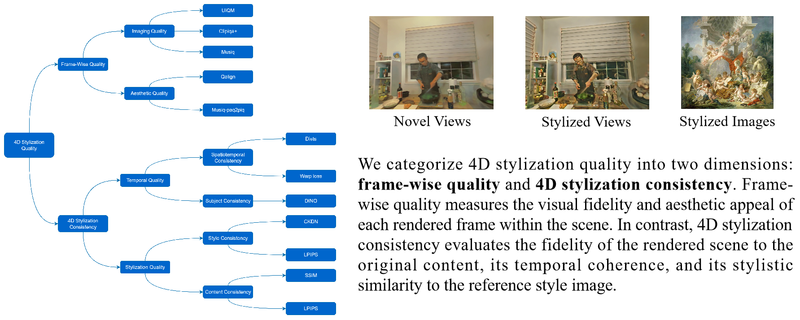

<h1>Style4D-Bench: A Benchmark Suite for 4D Stylization </h1>

    <a href='' target='_blank'>Beiqi Chen</a>*1,2&emsp;
    <a href='' target='_blank'>Shuai Shao</a>*2&emsp;
    <a href='' target='_blank'>Haitang Feng</a>3,2&emsp;
    <a href='https://cse.sysu.edu.cn/teacher/LaiJianhuang' target='_blank'>Jianhuang Lai</a>4&emsp;
    <a href='' target='_blank'>Jianlou Si</a>5†&emsp;
    <a href='https://wanggcong.github.io/' target='_blank'>Guangcong Wang</a>2† 

    1Harbin Institute of Technology&emsp;
    2Vision, Graphics, and X Group, Great Bay University 
    3Nanjing University&emsp;
    4Sun Yat-Sen University&emsp;
    5Alibaba Group

   
                *Equal Contribution&nbsp;&nbsp;&nbsp;&nbsp;
                †Corresponding Authors

 :baby_chick: [Project](https://becky-catherine.github.io/Style4D) | [YouTube](https://youtu.be/Tf6QnksXFxQ) | [arXiv]() 

<tr>
    
</tr>

:baby_chick: <strong>Abstract:</strong> We introduce Style4D-Bench, the first benchmark suite specifically designed for 4D stylization, with the goal of standardizing evaluation and facilitating progress in this emerging area. Style4D-Bench comprises: 1) a strong baseline that make an initial attempt for 4D stylization, 2) a comprehensive evaluation protocol measuring spatial fidelity, temporal coherence, and multi-view consistency through both perceptual and quantitative metrics, and 3) a curated collection of high-resolution dynamic 4D scenes with diverse motions and complex backgrounds. To establish a strong baseline, we present Style4D, a novel framework built upon 4D Gaussian Splatting. It consists of three key components: a basic 4DGS scene representation to capture reliable geometry, a Style Gaussian Representation that leverages lightweight per-Gaussian MLPs for temporally and spatially aware appearance control, and a Holistic Geometry-Preserved Style Transfer module designed to enhance spatio-temporal consistency via contrastive coherence learning and structural content preservation. Extensive experiments on Style4D-Bench demonstrate that Style4D achieves state-of-the-art performance in 4D stylization, producing fine-grained stylistic details with stable temporal dynamics and consistent multi-view rendering. We expect Style4D-Bench to become a valuable resource for benchmarking and advancing research in stylized rendering of dynamic 3D scenes. 

<tr>
    
</tr>

<tr>
    
</tr>

:baby_chick: <strong>Framework Overview:</strong> Style4D consists of three key components, a basic 4DGS representation, a Style Gaussian Representation, and a Holistic Geometry-preserved Style Transfer. We first train a basic 4DGS representation with the content image to obtain 4D scene geometry. Then we propose a new Style Gaussian Representation for 4D stylization. We also introduce a Holistic Geometry-preserved Style Transfer module to improve consistency and quality of stylization.

<tr>
    
</tr>

:baby_chick: <strong>Evaluation Metrics:</strong> Quantitative comparisons of our proposed Style4D against state-of-the-art methods on Style4D-Bench.

##  Citation

If you find this useful for your research, please cite the our paper.

## Acknowledgement

The computational resources are supported by SongShan Lake HPC Center (SSL-HPC) in Great Bay University. This work was also supported by Guangdong Research Team for Communication and Sensing Integrated with Intelligent Computing (Project No. 2024KCXTD047).

